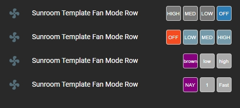

# Fan Mode Button Row
Provides a means to program 2 or 3 preset mode settings for fans selectable from a Lovelace button row.

## NOTE: You must be on Home Assistant V2021.3.X or higher to use this plug-in

Installation:

The easiest way to install this is to use the Home Assistant Community Store (HACS) in Home Assistant.

Follow the instructions there for installation making sure you note the "url:" section for the resources addition.


Conversely, if you don't use HACS you can install it manually by performing the following:

Copy the fan-mode-button-row.js file to the appropriate folder in your Home Assistant Configuration directory (/config/www/).

Place the following in your "resources" section in your lovelace configuration (updating the location to where you placed the above file):

  ```
    - url: /local/fan-mode-button-row.js
      type: module
  ```
    
Then to use this in a card place the following in your entity card:


<b>Options:</b>

| Name | Type | Required | Default | Description |
| --- | --- | --- | --- | --- |
| entity | String | Yes | none | any fan entity_id |
| type | String | Yes | none | custom:fan-mode-button-row |
| customModes | Boolean | No | false | Set to true to use custom mode definitions |
| modeOff | String | No | 'off' | Sets the mode for the 'OFF' button (see NOTE 2 below) |
| modeOne | String | No | 'low' | Sets the mode for the 'Mode 1' (default 'LOW') button |
| modeTwo | String | No | 'medium' | Sets the mode for the 'Mode 2' (default 'MED') button |
| modeThree | String | No | 'high' | Sets the mode for the 'Mode 3' (default 'HIGH') button |
| width | String | No | 30px | A custom width for the buttons |
| height | String | No | 30px | A custom height for the buttons |
| name | String | No | none | A custom name for the entity in the row |
| customTheme | Boolean | No | false | set to true to use a custom theme |
| reverseButtons | Boolean | No | false | set to true to reverse the button order |
| isOffColor | String | No | '#f44c09' | Sets the color of the 'OFF' button if fan is off |
| isOnModeOneColor | String | No | '#43A047' | Sets the color of the 'Mode 1' (default 'LOW') button if fan is on Mode 1 |
| isOnModeTwoColor | String | No | '#43A047' | Sets the color of the 'Mode 2' (default 'MED') button if fan is on Mode 2 |
| isOnModeThreeColor | String | No | '#43A047' | Sets the color of the 'Mode 3' (default 'HIGH') button if fan is on Mode 3 |
| buttonInactiveColor | String | No | '#759aaa' | Sets the color of the the buttons if that selection is not "active" |
| customText | Boolean | No | false | Set to true to use custom text for buttons |
| customOffText | String | No | 'OFF' | Sets the text of the 'OFF button |
| customModeOneText | String | No | 'LOW' | Sets the text of the 'Mode 1' (default 'LOW') button |
| customModeTwoText | String | No | 'MED' | Sets the text of the 'Mode 2' (default 'MED') button |
| customModeThreeText | String | No | 'HIGH' | Sets the text of the "Mode 3" (default 'HIGH') button |
| twoModeFan | Boolean | No | false | Set to true to hide the middle mode button ('modeTwo') for fans with only two modes |


NOTES:

1. The default values for the service calls and button text are as noted above. If you need to use custom modes then you need to set the values of the mode buttons to exactly match the modes you want to control with this plug-in. 

2. The "modeOff" button will ALWAYS turn the fan off no matter what the mode is set to for that button. However, if you use custom modes (customModes = 'true') the button text will change to display the mode name as set in the custom mode setting of the buttons. So, even though the "modeOff" button will only ever turn the fan off you may want to set a different mode for that button to display the desired text for the button.

3. If, however, you choose to use custom text (customText = 'true') the custom text settings for the button will override both the default names AND the custom mode names.

Yes, it's a bit confusing but to summarize:

- customModes = 'false' and customText = 'false' => default text as noted in the table above will be used

- customModes = 'true' and customText = 'false' => text will be what is set for the mode for each button (Only true for modes changed from default above, otherwise they will display the defauilt mode text)

- customText = 'true' (no matter what customModes is set to) => text will be what is set for each button by the custom text setting (Only true for text changed from default above otherwise they will display the defauilt text)

That's the best I can explain it. Feel free to poke around at it and hopefully it will make more sense.

The values for the colors can be any valid color string in "HEX", "RGB" or by color name.

If the mode is changed via any other means (slider, service call, etc) the buttons will indicate which mode it is in.

<b>Configuration Examples:</b>
    
  ```
    cards:
      - type: entities
        title: Hall Fan Mode Preset Modes
        show_header_toggle: false
        entities:
        ## USE THIS CONFIG TO HAVE IT MATCH YOUR THEME ##
          - entity: fan.hall_fan
            type: custom:fan-mode-button-row
            name: Fan Not Custom Theme
        ## USE THIS CONFIG TO USE A DEFAULT CUSTOM THEME
          - entity: fan.hall_fan
            type: custom:fan-mode-button-row
            name: Fan Default Custom Theme
            customTheme: true
        ## USE THIS CONFIG TO USE A 'CUSTOMZED' CUSTOM THEME
          - entity: fan.hall_fan
            type: custom:fan-mode-button-row
            name: Fan Custom Custom Theme
            reverseButtons: true
            customTheme: true
            isOnMode1Color: 'rgb(255, 0, 0)'
            isOnMode2Color: '#888888'
            isOnMode3Color: '#222222'
            isOnMode4Color: 'purple'
            buttonInactiveColor: '#aaaaaa'
        ## FULL EXAMPLE CONFIGURATION
          - entity: fan.hall_fan
            type: custom:fan-mode-button-row
            name: Fan Custom Button Text
            twoModeFan: true
            reverseButtons: true
            customTheme: true
            isOnModeOneColor: 'rgb(255, 0, 0)'
            isOnModeTwoColor: '#888888'
            isOnModeThreeColor: '#222222'
            buttonInactiveColor: '#aaaaaa'
            isOffColor: 'purple'
            customModes: true
            modeOff: "brown"
            modeOne: "low"
            modeTwo: "medium"
            modeThree: "high"
            customText: true
            customOffText: 'NAY'
            customModeOneText: '1'
            customModeTwoText: 'mid'
            customModeThreeText: 'Fast'
            width: '15px'
            height: '15px'
            
  ```

Please see my fan packages in my Home-Assistant Repo for example configurations to use the above plugin configurations.

https://github.com/finity69x2/Home-Assistant/tree/master/packages

Examples of the above plugion configurations:



